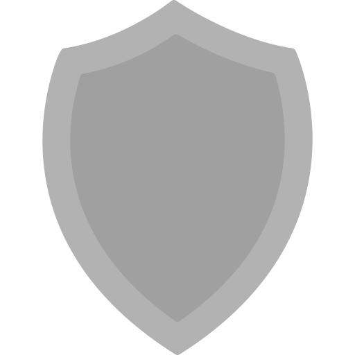

<a name="readme-top"></a>

[![Contributors][contributors-shield]][contributors-url]
[![Forks][forks-shield]][forks-url]
[![Stargazers][stars-shield]][stars-url]
[![Issues][issues-shield]][issues-url]
[![MIT License][license-shield]][license-url]
[![LinkedIn][linkedin-shield]][linkedin-url]


<br />
<div align="center">
  <a href="https://github.com/lcram33/collatz-cipher">
    
  </a>

  <h1 align="center">Collatz cipher</h1>
  
  <h2 align="center">
    A polyalphabetic cipher that derivate a key from Hasse's algorithm.
  </h2>

  <h3 align="center">
    <br />
    <a href="https://github.com/lcram33/collatz-cipher/issues">Report Bug</a>
    ·
    <a href="https://github.com/lcram33/collatz-cipher/issues">Request Feature</a>
  </h3>
</div>


<!-- ABOUT THE PROJECT -->
## About The Project

<p align="left">
  A polyalphabetic cipher that uses Hasse's algorithm with a huge number to substitute characters from a randomly mixed charset.
  See paper for more details on how it works.
</p>


### Warning !


<b>
I do not provide any warranty that this cipher is in any way reliable.
<br>
DO NOT USE WITH CRITICAL DATA !
</b>
<br>
No research was made on it so far. Your welcome to contribute in any way !


### Break me !

In <i>challenge/challenge.py</i>, you will find a message encrypted with an unknown key. If you manage to find the original message, it would be a pleasure to know how you did it ! See the contact section.

Please note however that the charset changed. See <i>challenge/params-challenge.py</i> for more details.


### Built With

<a href="https://www.python.org">
  
</a>


## Technical part (how it works)

<i>This part was moved to the unofficial paper. See pdf document in the repo.</i>


## Security considerations



As said before, no expert have audited my code and concept. I just made this for fun as an amateur. However, here are some security consediration. Again, any correction or material to add is welcome !

<i>This part was moved to the unofficial paper. See pdf document in the repo.</i>


<!-- GETTING STARTED -->
## Getting Started

To get a local copy up and running follow these simple example steps.


### Prerequisites

python3 (should come with your favorite distro)
  ```sh
  sudo apt update && sudo apt install python3
  ```


### Installation

1. Clone the repo
   ```sh
   git clone https://github.com/lcram33/collatz-cipher.git
   ```
2. cd into the created folder
   ```sh
   cd collatz-cipher
   ```

3. Start the program
   ```sh
   python3 test.py
   ```


<!-- USAGE EXAMPLES -->
## Usage

A command line program is still in progress. For the moment, the cipher is usable as shown in <i>test.py</i>.


### Other programs in this repo

* <i>seeded_key.py</i> allows to create keys using a random passphrase, allowing an easier key sharing and key recovery.
* <i>secure_pwd_gen_api.py</i> comes from [one of my other projects](https://github.com/Lcram33/strong_password_generator). It can be used to generate passwords and passphrases for cryptographic use.
* <i>test_randomness.py</i> is to test how "randomly" are the shiftings distributed.


<!-- ROADMAP -->
## Roadmap
<h3>
- 🗹 Base program <br>
- ☐ Command line interface (work in progress)
</h3>

See the [open issues](https://github.com/lcram33/collatz-cipher/issues) for a full list of proposed features (and known issues).


<!-- CONTRIBUTING -->
## Contributing

Contributions are what make the open source community such an amazing place to learn, inspire, and create. Any contributions you make are **greatly appreciated**.

If you have a suggestion that would make this better, please fork the repo and create a pull request. You can also simply open an issue with the tag "enhancement".
Don't forget to give the project a star! Thanks again!

1. Fork the Project
2. Create your Feature Branch (`git checkout -b feature/AmazingFeature`)
3. Commit your Changes (`git commit -m 'Add some AmazingFeature'`)
4. Push to the Branch (`git push origin feature/AmazingFeature`)
5. Open a Pull Request


<!-- LICENSE -->
## License

Distributed under the GPL-3.0 license. See `LICENSE` for more information.


<!-- CONTACT -->
## Contact

✉️ lcram33@pm.me

Project Link: [https://github.com/lcram33/collatz-cipher](https://github.com/lcram33/collatz-cipher)


## Credits

<a href="https://www.flaticon.com/free-icons/caesar-cipher" title="caesar cipher icons">Caesar cipher icons created by Pixelmeetup - Flaticon</a>
<br>
<a href="https://www.flaticon.com/free-icons/warning" title="warning icons">Warning icons created by Freepik - Flaticon</a>
<br>
<a href="https://www.flaticon.com/free-icons/safe" title="safe icons">Safe icons created by Assia Benkerroum  - Flaticon</a>

<!-- MARKDOWN LINKS & IMAGES -->
<!-- https://www.markdownguide.org/basic-syntax/#reference-style-links -->
[contributors-shield]: https://img.shields.io/github/contributors/lcram33/collatz-cipher.svg?style=for-the-badge
[contributors-url]: https://github.com/lcram33/collatz-cipher/graphs/contributors
[forks-shield]: https://img.shields.io/github/forks/lcram33/collatz-cipher.svg?style=for-the-badge
[forks-url]: https://github.com/lcram33/collatz-cipher/network/members
[stars-shield]: https://img.shields.io/github/stars/lcram33/collatz-cipher.svg?style=for-the-badge
[stars-url]: https://github.com/lcram33/collatz-cipher/stargazers
[issues-shield]: https://img.shields.io/github/issues/lcram33/collatz-cipher.svg?style=for-the-badge
[issues-url]: https://github.com/lcram33/collatz-cipher/issues
[license-shield]: https://img.shields.io/github/license/lcram33/collatz-cipher.svg?style=for-the-badge
[license-url]: https://github.com/lcram33/collatz-cipher/blob/master/LICENSE
[linkedin-shield]: https://img.shields.io/badge/-LinkedIn-black.svg?style=for-the-badge&logo=linkedin&colorB=555
[linkedin-url]: https://linkedin.com/in/marc-lecointre
